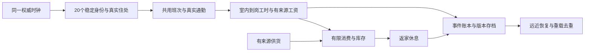

# 霓港世界模拟器：港湾样板与原创全城计划

本轮按用户要求停止新增制作、GPU采集和流程修复，以独立分支`codex/harbor-v08-world-sample-arrival-integration-20261005`保存包括未完成工作；实际交接commit以该分支`git rev-parse HEAD`及GitHub分支指针为准，收尾结果由最终回复给出。不合入main、不打发布tag、不部署Pages，v0.8未上线，公开仍v0.7。完整港湾／AAA未完成；native expected runtime字典仍旧208项而实际构建214项，归档脚本含旧绝对路径，须接手后更新／重绑，不能直接当ready运行。 接手主入口：[2026-10-05交接](HANDOFF_2026-10-05.md)。

记录日期：2026-10-05。先完成用户选定的高品质港湾样板，再逐区连接具有香港式密度、地形和交通气质的原创城市。区名、道路、站点、商号和路牌使用原创名称。GTA 与《赛博朋克 2077》是视觉与制作标杆，完成依据是实际场景、连续操作和居民生活；建筑、资源与规则数量不替代这些工作。

**当前阶段：港湾样板制作基线，在制，v0.8 未发布，公开试玩仍v0.7。** 整合预览实际通过429/429 CPU规则与静态构建，0.8.0 / revision:null / 214运行资源；可比415源码目录为历史409输入加六个新客户端模块，非全仓库计数。Office V3.1工作位及South Spot低墙灯光 / 小轮形体只获得局部接受；三职业与港湾共同日历已有CPU验证。完整港湾美术、人物动作、三职业原生生活、三型整段High和真实设备尚未签收。新整图图形CI待执行，旧199原失败保留；详细证据见[QA](QA_V08.md)。

下一制作优先把住宅、岗位、店铺与三种车船连成可跟随的港湾生活体验：用公开操作和真实时间检验三职业与整段路线，再围绕近景所见精修家具、人物、街景和船舱。完成港湾验收后才扩展新的城区。

## 第一轮要交付的港湾体验

玩家从住宅楼上起步，经过实体楼梯和房门到街道，乘双层巴士上层观看两岸街景，进入小店或工坊，乘双层小轮渡海，访问对岸室内，再搭街头电车返家。交通和生活在室内探索期间继续推进，保存后按明确规则恢复。先完成三个不同岗位的同钟相互影响，再按可跟随的真实居民覆盖扩展；20 名全闭环是助手此前计划设定的后续规模，并非用户硬性指定。目标是共用一个世界时钟，各有住处、岗位、通勤、有效工时、有来源工资、有限消费及休息，远近切换不重置身份和账本。

| 内容 | 有限制作范围 | 完成依据 |
| --- | --- | --- |
| 两岸街景 | 住宅街、六店街段、两岸码头 / 站台及可辨认港湾背景；地表、地标、树和灯具构成连续路线 | 同机位同时间同画质前后原图、昼夜宽景与近景、步行 / 车上层 / 甲板的动态观察 |
| 住宅与室内 | south-079 两层四房住宅、south-086 工坊 / 档案、六家对应用途首层、对岸办公室与观景空间 | 家具尺度和用途可信；房门、楼板开口、楼梯、电梯、通道及真实进出 / 恢复 |
| 三种交通 | 现有 2 巴士、2 电车、1 小轮、11 站，保留完整外壳与可行走双层 | 三型全外观、下层 / 实体梯 / 上层、正常 E 出口、行驶 / 靠泊、异常恢复与 LOD |
| 人物与日常 | 玩家和三类近景人物，20 名稳定身份与住宅 / 岗位 / 车船 / 商店绑定 | 玩家脸 / 衣物与动态姿态；先逐人验收三种岗位的实际路线、资金 / 库存与save / event，再扩大剩余17人的完整覆盖，20稳定身份持续保留 |
| 完整路线 | 住宅 → 巴士上层 → 小店 / 工坊 → 小轮上层 → 对岸室内 → 电车上层 → 返家 | ≥20 分钟公开操作连续录像，无调试传送；绑定最终资源，Low 功能与 High 画面分开 |
| 可分享客户端 | 浏览器可操作、默认 High、单人主站与仓库内最多 8 人私人房间后端 | 最终门禁、部署、公开 build-info / 全资源指纹与真实加载；公网多人后端另行部署 |

当前已接入三种不同岗位、港湾 20 人与车船共同日历及其 CPU 检查，剩余 17 人仍有真实部分生活逻辑；三职业原生跟随 / 动作 / 恢复尚待验收。只有前表的画面、生活、控制、恢复与设备门槛实际完成，才能称完整高品质港湾样板。

## 当前基础与实际资产

三岸目录实际为 **220 栋 / 4,150 层**：北岸 48 / 920、南岸旧城 96 / 501、东湾 76 / 2,729。室内主要为共享用途布局，仅驻留当前及相邻三个精细楼层，没有逐栋逐房手工精修。集装箱、设备、雕塑和地形不计为可进入建筑。历史检查点的 4,374 层不沿用为当前统计，来源差异见 [三岸计划](REAL_CITY_V08_PLAN.md) 和 QA。

### 本轮五个制作工作包

| 制作包 | 已连接内容 | 完整样板必修 |
| --- | --- | --- |
| 工坊 / 档案 | south-086，5 GLB、工台和一名居民短工 | 把空地与四张稀疏工台组织成工作、储藏、档案与收货区；补工具、线缆、纸物、照明与实际动作，保持通道 |
| 六家小店 | 六套原创立面与对应首层房间，檐棚、店招、桌椅与商品 | 转角、玻璃、商品陈设和内外用途连续；店员到岗、可读门口、日夜照度与街景密度 |
| 三型双层交通 | 9 GLB、真实 Blender 母模、实体楼梯、车门及共用班次 | 整车 / 整船轮廓与材质；小轮平板长椅、重复木纹、大片平顶 / 支柱的造型；舱内乘客、动态与正常出口 |
| 三套人物 | worker / commuter / shopkeeper 核心角色，共用近景资产库 | 玩家脸部、头发、手、衣服厚度 / 褶皱；走停转身、上下梯、工作和消费动作。全局 12 近景实例是驻留预算 |
| 一户住宅 | south-079 两层四房，4 GLB、曲面沙发、家具与标签 | 沙发 / 床品软硬材料层次、织物垂坠、生活痕迹、家具尺度与房间照明，四房实走及重入 |

工坊 [资产 / 许可](../assets/harbor/workshop/asset-manifest.json)、住宅 [资产 / 来源](../assets/harbor/home/asset-manifest.json)、[交通 Blender 母模](../art-source/transport/README.md)与[人物来源档案](../art-source/near-resident/README.md)可检查。保留米制几何、UV / 法线 / 切线、PBR、碰撞代理、LOD、许可与可编辑原件。人物原件使用 glTF / BIN 与转换工具，不虚构不存在的角色 `.blend`。源码、QA 和母模不进入静态客户端。

## 本轮必须完成的美术制作顺序

官方 [GTA V Enhanced 产品说明](https://store.rockstargames.com/game/buy-gta-v)同时列出环境遮蔽、全局光照、阴影 / 反射与 SSD / DirectStorage 加载；[CDPR 1.62 公告](https://www.cyberpunk.net/en/news/47875/patch-1-62-ray-tracing-overdrive-mode)区分高成本路径追踪实时游玩和单帧照片模式。参考它们的光照一致性、动态画面及装载成本。这两页未披露完整资产、动画和流式生产流程；下面的顺序来自本项目实际原图与未完成项，RTX 不是 Web 探索前提。

| 顺序 | 具体制作包 | 现有像素揭示的问题 | 关闭条件 |
| --- | --- | --- | --- |
| 1 | 三型完整外观与舱内 | 车门近照未覆盖整车 / 整船；电车接缝有源修订但尚无新完整画面；小轮舱内平板、木纹重复、顶棚空且无乘客 | High 全外观至少一张合法三分之四视角，另查轮组 / 船体、下层、梯和上层；公开登乘 / 出口与动态录像独立通过 |
| 2 | 港湾整体构图、山体、树与昼夜街道 | 规则斜纹已去除，山脊仍软灰泥感；叶片边缘生硬、花池盒体；夜路暗、树干 / 花池顶面局部过亮且缺少局部阴影，首夜机位有人体遮挡 | 同一南岸合法站点分别 16.5 / 21 的新源全景；再做岩层轮廓、树枝叶连接、道路 / 灯域精修与同条件前后对照 |
| 3 | 住宅、工坊、办公室与观景 | 沙发与 Office V3.1 工作位局部接受；工坊空且四台稀疏、办公室密度 / 材料仍不足，观景图多天空、港湾不足 | 把明确用途做进真实家具和陈设；住宅四房、工坊各区、办公室与真实港湾视线分别近看 / 实走签收 |
| 4 | 玩家与居民造型 / 动作 | 脸部细节有限，手与持物、身体僵硬，静帧不能证明工作动画 | 玩家脸 / 衣服全身，三类人物走停转身、上下梯、工作 / 购买 / 休息动态；有限高细节实例不改变逻辑身份 |
| 5 | 三职业同钟生活现场、恢复与预算，再扩展居民覆盖 | 三职业与港湾共同日历 CPU 通过；原生跟随 / 动作待验，剩余 17 人真实部分生活，北岸与多人经济未统一 | 三职业实际操作与账本 / 保存恢复逐人验收，普通购物队列及剩余覆盖逐步制作；20 全闭环为后续规模，完整路线及真实设备另验 |

历史五个全外观 / 南岸宽景机位来自两个失败批次的四张 partial 原图与一次成功 single Night，均保留原 15c 来源及组件范围，不拼成整场通过。Office V3.1 / South Spot 新原图有限接受已记入当前状态，历史失败不改判；新整图昼夜、多机位与完整路线仍待执行。

## 原创城市分区

表中港湾是当前制作包，其余分区在港湾完成后推进。每包先完成一条可回归的街区生活路线和对应空间，再按实测预算扩展；它们尚未制作完成。

| 分区 | 地形与街道气质 | 下一有限制作包 | 独立验收路线 |
| --- | --- | --- | --- |
| 潮光港湾 | 两岸海湾、步道、密集住商街与客运码头 | 完成上述住宅 / 六店 / 工坊 / 对岸室内、三型交通、港湾昼夜和 20 人同钟；现有样板继续精修 | 楼上住宅 → 六店街 → 巴士 → 工坊 → 小轮对岸 → 电车 → 返家 |
| 榕树旧城 | 骑楼、窄街、市场、后巷和楼上住宅 | 两条相连街段、一个市场院、三类住宅 / 店内房间、两家新增业态与一条实际补货服务链 | 住宅实体梯 → 市场采购 → 后巷收货 → 店铺岗位 → 电车返家 |
| 岭光山城 | 坡道、挡墙、连续阶梯与山腰住宅 | 一条坡地巴士街、两条阶梯步道、一组公共升降连接、两处住宅室内与一个真正看海的观景点 | 海滨车站 → 坡地巴士 → 阶梯 / 升降机 → 山腰住宅 → 观景返程 |
| 星汇中城 | 密集塔楼、街边商业、连廊和广场 | 一条办公通勤走廊、两座重点塔楼的实际用途楼层、一处连廊商业及一个有限服务岗位链 | 地铁 → 街面 / 连廊 → 楼梯 / 电梯到岗 → 午间消费 → 返程 |
| 东湾新区 | 新住宅、社区商业、滨水公共设施 | 一个住宅社区街段、两类家庭室内、一处学校 / 社区服务、一条公交 / 小轮接驳 | 住宅 → 社区消费 / 服务 → 站点跨岸到岗 → 返家 |
| 白帆工业岸与外岛 | 货运岸线、仓库、工坊与岛屿聚落 | 一组岸上货栈 / 工坊、一个岛上聚落街段、客货两条有来源路线及对应有限补货账本 | 岸上领货 → 装船 / 渡海 → 岛上交货与消费 → 客运返程 |

同一技术和基础资产可以复用，街巷高宽关系、转角、地标、立面节奏、店铺组合、家具用途和居民关系要在每包中实际制作。密度由人眼高度的连续街景、拥挤通道及交通 / 生活关系判断。香港只作为开发参考，游戏不照搬真实地名、品牌或商业游戏资产。

## 全城尺度与扩展路径

全城目标包括连续城区、坡地、山城和外岛，没有 1:1 测绘整座香港的交付承诺。当前 X/Z ±1,800 米只是 **3.6 公里 × 3.6 公里的允许位置验证包围范围**，不是已制作的 12.96 平方公里；220 栋共享室内也不是全城精修完成。

后续采用稳定全局区域 ID 与区内米制坐标；建筑、房间、站点、车船、旅程与居民保留独立身份。渲染浮动局部原点，原点移动不改变存档、世界时钟与路径。邻近物理采用同一参考系，跨区同时核对乘客、车辆、碰撞和地面支撑。区域、站点、路线、存档与多人 `worldId` 迁移需有旧存档映射和可回退版本，不能只扩大坐标上限。

远景 HLOD 保留城市轮廓，近处街道、车船和室内按距离、方向及实际旅程预取、分帧装配与预算回收。**Streaming 用于保留 High 的近景品质。** 地面、楼板、桥、楼梯及登乘通道的支撑独立于可见细节，仍被玩家、居民或车船使用时不得卸载。转动相机不能让脚下空间消失，进入室内也不能暂停全区交通与生活。

## 统一生活时钟与有限经济

港湾 20 名街坊与本地共用车船已接入每小时 120 模拟秒的共同日历，包含旧存档迁移。07 杨远舟保留工坊短工、购物与返家路线；01 陈映川从 south-093 住宅步行到果铺柜台，按实际到岗工时领取由雇主出资的工资；11 许亦庭从 south-084 住宅前往货栈，领取已有订单、实际取货 / 送货、午休后继续工作并返家。钱、货、工资和运费使用已有有限事务，不凭空生成订单、资金或库存。其余 17 人仍有真实住家、部分轮班 / 工资、消费和通勤逻辑，尚无同等完整室内生活链。三职业的 CPU 检查已通过并包含在本次 429 项规则内；新整合资源的逐人原生 High 跟随、工作动作和恢复仍待验收。北岸原 240 人与多人服务的权威经济尚未统一到该日历。20 人全闭环是后续覆盖计划，不是用户硬性指定的人数。

普通购物实体队列仍待制作。新配送联系绕行逐段采样真实地面并拒绝进入未获正常路口准入的道路条带；该修复不改变脚高或地面。旧浮空反例与失败保留，具体源变化和独立样本审查见 QA。

港湾本地共同日历已接入；后续全覆盖生活包为 20 人逐个配置稳定身份、真实住宅 / 岗位、共享车船班次、有效工时、工资出资、有限消费和休息。一次完整周期写入事件账本，保存身份、旅程、时钟、工时、钱货、交易 ID 与已发工资；重载和重复进入不重复发薪。缺勤不发工资，雇主无钱时等待或换岗，商店缺货不凭空补满。远区低频推进，近处升级路径与动作，人口日常不依赖是否绘制高细节模型。

20 人的 home / work / commute / consumption / rest 和 save / event 均须逐一可检查，不能只统计状态名或选一人代表全部。先固定居民与实际空间的关系，再加密人群和扩城。当前玩家库存尚无进食 / 物品使用，三店每种商品初始 4 份、货栈 96 份，补货和运费来自实际库存 / 出资；后续生产、物品消耗与供货需有数量、时间和成本。

图中是完整生活包的目标，当前未实现全部 20 人。单人先由客户端维护一致状态；后续多人迁入服务端权威时钟与钱货账本，规定有限离线追赶，避免无界运算或凭空收益。

## 资源、真实设备和多人

现有室内仅驻留三个相邻精细楼层，近景人物全局最多 12 实例、玩家优先；六店和车船管理各自 LOD 与所有权。扩展保留导航、地面、碰撞和远景层，街区以内容哈希组织，过桥 / 入室 / 跨区乘车提前加载。下载失败保留支撑和可恢复状态；增加曲面、厚叶与纹理要登记装配、三角、绘制、内存和显存成本。

| 设备 / 链路 | 尚未测量的目标 | 实测要求 |
| --- | --- | --- |
| 桌面独显 | 1080p High、60 FPS，p95 ≤20 ms、p99 ≤33 ms | 明确 CPU / GPU / 内存 / 浏览器，完整路线的帧时间、最长停顿与驻留 |
| 桌面集显 | 900p Balanced、30 FPS | 实际设备帧时间、最长停顿和内存 |
| 冷启动 | 25 Mbps / 40 ms，首次可操作 ≤8 秒，核心首包 ≤30 MB | 冷缓存从导航到控制 / 支撑就绪，记录真实传输 |
| 精细街区 | 单区压缩传输 ≤60 MB | 解码 / 装配、CPU / GPU、内存 / 显存峰值与反复回收 |

以上都是目标，尚无真实硬件成绩。软件 WebGL 功能、截图、CPU 三角计数和平均 FPS 不能代替真实 GPU 分位数，不能靠降低默认画质关闭预算门槛。

继续保留最多 8 人私人探索服务、玩家 / 共用车辆 / 聊天；GitHub Pages 主站默认单人，公网多人后端尚未部署。全城多人权威、居民经济与时钟同步是后续服务包；同室内 / 同车船 / 附近街区兴趣同步、交易去重、断线 / 跨区恢复和容量分别验收。

当前维持可分享 Web / Three.js / Pages 客户端。先测真实 CPU / GPU、帧时间和驻留，再决定 WebGPU、独立客户端或引擎迁移；迁移保留世界数据、存档、交通、居民、有限经济、连续楼梯 / 电梯和现有多人探索功能。

## 按证据推进的阶段

| 阶段 | 当前状态 | 结束条件与下一工作 |
| --- | --- | --- |
| 新源验证与缺口定位 | 本地整合 429/429 CPU、null/214 构建实际通过；新整图图形 CI 待执行，历史 199 原失败保留 | 最终源图 / 提交绑定、原有功能与双浏览器多人、三型 High / 昼夜 / 动态实际结束；首错及美术问题登记 |
| 港湾高品质制作 | Office V3.1 与 South Spot 组件接受；三职业同钟 CPU 通过，整体验收仍在制 | 车辆 / 山树街灯 / 住宅工坊办公室 / 人物动作、不同岗位日常及 save / event 原生验收，剩余居民覆盖如实登记 |
| 完整港湾交付 | 尚未完成 | ≥20 分钟真实连续路线、最终源树功能与双浏览器多人、完整样板 High、目标硬件和发布 / 全资源 / 归档核对 |
| 旧城与山城 | 未进入完成验收 | 先完成各有限街区包，坡地 / 楼内连续通行与跨区返程、生活账本、独立画面及设备预算 |
| 中城、新区、工业岸与外岛 | 后续制作 | 每区实际空间、独立生活与运输路线、跨区保存恢复和完整旅程成本 |

不预填日期、人天、未实测人口或未来 PASS。阶段成果可以先发布为开发预览；发布说明保留当前交付范围与待做包，完整高品质样板和全城目标继续在制。上线、功能、美术、生活、性能和原件持久归档各有实际证据后才关闭相应门槛。

Motion 与 Ferry 当前范围：Motion before／candidate原生High均实际exit0；20张原PNG只有限接受本地0.8米/秒慢走的较短步幅与柔和停姿。它们是两张英雄图＋八张稀疏RAF帧各一组，不是连续视频；完整人物动作、接触连续性／脚滑、正常速度、楼梯、工作／持物及真实硬件仍未验收。原图各自绑定199/208 baseline与motion-only null/209候选，不能冒充最新214整图原生验收。

Ferry 原生摄影方法的整场预算由 40 分钟改为 50 分钟，Ferry CI 工作预算由 110 分钟改为 130 分钟；这是有限软件渲染墙钟安排，不是通过数量或性能成绩。巴士 / 电车预算保持原值，画质、模拟速度、物理、端点、局部限时和最终公开 E 出口断言保留。原 199 的 40 分钟失败与 lower-4 首错保留；新 50 / 130 方法尚未取得原生通过。

本次收尾增量：south-085货栈立面增量（`src/harbor-arrival-warehouse.js`）完成12项定向CPU与3项独立几何检查，未获原生美术接受。街景baseline213实际采集exit1：真实E进入south-085／(200,.215,-180.1)／224碰撞体／174家具已成功，collector误要求普通大厅global outdoor=false导致180秒等待超时。完整E进出和两張计划照片未完成；保留日志与失败元数据，不保证失败PNG，也不把进楼判为失败。本轮不修collector或重跑。
