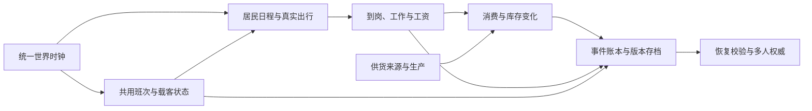

# 霓港世界模拟器：海港样板与全城制作计划

记录日期：2026-10-04。本文区分本轮样板制作与未来全城目标，验收状态见 [海港样板验收表](HARBOR_SAMPLE_ACCEPTANCE.md)。没有相应证据的项目保持待验收。

## 先完成一个能连续生活的海港样板

成品方向是一座具有香港式密度、地形与公共交通气质的原创海滨城市：近处有可信的建筑、人物和车辆，街道可以步行探索，住宅、工作、商店与交通由同一套世界状态连接。GTA 与《赛博朋克 2077》用于比较街景制作、材质、人物动作和世界连续性；达到类似质量需要正式资产制作与实际游玩验收，不能由楼层数量或功能测试推导。

第一优先级是完整海港样板：精修两岸街景、双层巴士、经典双层渡轮、双层街头电车，以及居民的日常生活闭环。先把一条路线做到可看、可玩、可保存，再扩展整座城市。地图变大、增加共享室内或新增交通名称不构成样板完成。

## 已有基础与交付边界

当前 v0.8 先从公开 v0.7 提交 `a425667bd2fec0c81f482a89861c88c2acd2641e` 继续开发，随后对照保留的原检查点 `32ee844` 补回材质、建筑用途及导览加载覆盖；原未提交目录仍未取回，来源和差异见 [v0.8 验收](QA_V08.md)。现有目录为 220 栋、4,150 个连续楼层，包含北岸 48 栋 / 920 层、南岸 96 栋 / 501 层、东湾 76 栋 / 2,729 层；它们提供通行、室内加载与测试基础，仍有大量共享布局与程序生成资产。具体既有状态以 [v0.8 计划](REAL_CITY_V08_PLAN.md) 和 [v0.8 验收](QA_V08.md) 为准。

本计划不改变既有 v0.8 的验收结论。新样板的模型、交通、街区与生活模块需要单独举证。样板只承诺选定路线及其沿线地点的完成度；路线以外的原有城区仍按原有质量标注。全城则要求每个区拥有自己的内容、居民网络与性能证据。

### 2026-10-04 新样板实现范围

以下是最终隔离集成源码连接的范围，不是浏览器验收通过表。本轮实际完整规则 342/342 通过，0 失败、0 取消、0 跳过，126.857 秒、静态构建通过，190 个运行资源指纹；原生 High 与发布仍待验收。构建 `revision:null`，SHA-256 `e45cdf73c892a8e79c0977a7cc2f4b873cbcf7653cb920026d054191eb749c9d`，不能写成已提交或已上线版本。

| 内容 | 当前实现 | 尚缺的成品证据或能力 |
| --- | --- | --- |
| 三种交通 | 5 辆：巴士 2、电车 2、渡轮 1；11 站：巴士 6、电车 3、渡轮 2；局部乘客坐标、下层门与上下层楼梯 | 完整路线中的渡轮衔接、班次受阻检查，以及从住宅起步的一次连续路线 |
| 沿街地点 | 6 处重点店面外观，底层实际用途与可进入房间 | 固定条件的街景和室内画面评审；对岸与返程的完整实际路线 |
| 居民与商业 | 20 位街坊；3 个沿街柜台提供有限商品、库存、购买与有资金来源的配送 | 居民完整离家、工作、消费、返家记录；远处模拟与缺货等异常现场验证 |
| 保存 | 新交通和生活状态写入本地存档，携货、交易、库存和时钟有保存字段 | 交通途中、精确室内位置与完整迁移的现场检查；尚无服务端权威世界状态 |
| 资产 | 5 件工坊 GLB、4 件住宅 GLB、三交通各 3 档共 9 件 GLB、3 套近景蒙皮角色及 6 套店面立面配置；米制来源、许可和可编辑文件保留 | 原生 High、实际通行 / 载客 / 回收和近景美术签收；样板以外仍主要是程序资产与共享布局 |
| 设备预算 | 已列出桌面、集显、链路和街区目标 | 真实目标硬件、受控链路和资源预算测量，当前未测量 |

独立的巴士、电车、渡轮和配送案例便于定位问题，但不能拼接为“连续 20 分钟样板通过”。现阶段的资产与功能实现也不能据此宣布达到 3A 质量。

### 早于本轮资产的局部证据

新样板 [首轮浏览器记录](qa/harbor-sample/verification/README.md) 为 3 项通过、1 项未通过：巴士和电车实际上下楼梯、行驶与下层出口通过；有资金来源的 8 份货物步行配送、12 元运费、6 元果蔬购买和货物 / 物品 / 时钟保存重载通过。渡轮首次在靠门时触发 600 秒整场限时，失败 trace 保留；依据该证据只将渡轮整场预算调至 900 秒，局部步行、交互和到站限时不变。后续发布构建单独复核渡轮通过，实际完成南岸登船、上下实体楼梯、航行与北岸正常离船，耗时 10.0 分钟。四个独立案例的通过证据来自明确记录的两次运行，不能将首轮追记为全绿。

首轮绑定合批前构建摘要 `eee79131221c700aa959b59509b770b8d1ee218c4586998aaec4a8ae52efaca8`，全量规则 283 / 283 通过；后续静态合批源树规则 285 / 285、发布构建的渡轮单项复核通过，其摘要为 `b83ccae70a56a111ec5bd44e550b48fbb47d0634caf5899035713341b2aa4ab9`。该构建的巴士、电车、生活完整重跑及远程发布门禁另由 CI 记录，不用规则检查替代。512 × 320 软件 WebGL 的 High 功能原图证明实际现场，不能认定原生近景美术或 GPU 目标达标。这些运行早于本轮五个制作工作包。住宅起步连续路线、居民完整日程、新 GLB / 蒙皮的实际游戏表现及目标硬件测量仍需独立验收。

0330 候选[完整远程记录](qa/post-checkpoint/remote-ci/README.md)中 27 个游戏场景已通过，多人启动配置失败另行保留；修复后[本地多人两场景](qa/post-checkpoint/multiplayer/README.md)实走通过。招牌与桌体修复后的[原生 High 五张图](qa/art-final/native-review/README.md)已审查，图中家具、人物及房间仍简化。这些历史局部结果不替代连续路线、完整居民日程、本轮正式资产或目标硬件验收。

居民过街互锁已按实际路径、完整车身和下一转弯扫掠修订；新的全量规则 302/302、0 失败 / 跳过，构建通过。[最终检查](qa/transit-crossing-repair/final-checks/README.md)包含真实全车流、标准旧存档、转弯与换段信号回归。完整浏览器路线另行执行；本轮正式资产的游戏表现、完整居民昼夜及硬件目标仍待验收。

## 原创城市分区

游戏中的城市、区名、站名、商号与路牌使用原创名称。真实香港地名只可出现在开发参考说明中。

| 分区 | 地形与街景特征 | 后续扩展内容 |
| --- | --- | --- |
| 潮光港湾 | 两岸海湾、海滨步道、商业街与客运码头 | 样板首发区；三种双层交通交汇，完整步行与室内路线 |
| 榕树旧城 | 骑楼、窄街、市场、旧式住宅与街头电车 | 小店库存、街坊生活、楼上住宅及巷道服务路线 |
| 岭光山城 | 坡道、挡墙、阶梯与山腰住宅 | 坡地巴士、连续高差通行、山城生活与观景路线 |
| 星汇中城 | 办公塔楼、连廊、密集商业与公共广场 | 工作日通勤、办公楼服务、商业供需与交通峰值 |
| 东湾新区 | 新住宅、社区商业、开放空间与滨水公共设施 | 家庭生活、学校与社区服务、跨区通勤 |
| 白帆工业岸与外岛 | 货运码头、仓库、工坊、岛屿聚落与海岸 | 生产与补货、货运和客运衔接、岛上居民生活 |

扩展时允许共享技术与基础资产；街道轮廓、地标、店铺组合、室内用途和居民关系必须逐区制作。现有北岸目录中的地点可作为素材与位置基础，最终分区、名称和路线变更需提供存档迁移。

## 海港样板的最小完整内容

| 对象 | 必须制作的内容 | 完成依据 |
| --- | --- | --- |
| 两岸街景 | 连续街道、码头、站台、路口、沿街店铺和可辨认地标；玩家视线内有完整地表与外壳 | 步行、驾驶、巴士上层和渡轮甲板的实际游戏画面 |
| 住宅 | 一处精修可住住宅，室内用途与家具合理，房门、楼梯、街道入口连续 | 从室内起步、走下楼、离开和返回；重载后恢复位置与物品状态 |
| 商店与工作地点 | 至少一家可交易商店和一处有实际工作行为的室内；对岸也有可进入地点 | 购物、库存变化、到岗和工资记录能互相解释 |
| 三种交通 | 双层巴士、经典双层渡轮、双层街头电车均有外观、两层空间、真实入口和实体楼梯 | 玩家与居民乘同一班次，经过车门或登船通道上下交通工具 |
| 居民生活 | 一组可辨认的常住居民，拥有稳定身份、住处、工作、需求和出行计划 | 跟随居民完成离家、乘车、工作、购物、返家，检查状态与存档 |
| 连续路线 | 住宅 → 街道 → 巴士上层 → 商店 / 工作 → 渡轮 → 对岸室内 → 电车 → 返回 | 至少 20 分钟连续游戏录像，全程使用公开操作，无调试传送 |

样板完成前不以新增建筑或全城人口数量作为主要产出。居民数量在制作时由可完成的路线、室内容量与真实设备预算决定，并在验收表记录实际数量。

目标路线的连通关系如下；具体运行结果仍以验收表和对应构建证据为准。

## 美术制作与资产管线

沿线近景使用人工制作或合法授权的正式 PBR 资产，建立 glTF / GLB 管线。巴士、渡轮、电车、人物、门窗、室内家具与街道地标需要明确的设计与制作；代码可以是可编辑的米制建模与导出工具，需交付新的有意设计的网格、材质与陈设；将旧盒体另存 GLB 本身不构成品质提升。

资产入库必须包含稳定 ID、来源与许可、米制尺度、坐标方向、枢轴、材质槽、包围盒、碰撞代理、LOD 版本及纹理预算。模型导出检查 UV、法线、切线、透明材质、纹理色彩空间与缺失依赖。可动门、轮组、楼梯、座椅和上下层空间有统一命名及交互挂点。压缩模型与纹理后重新检查画面和碰撞，不把压缩成功当作美术通过。

车辆必须有连续曲面、可信轮距和车身比例，近看车门、灯具、轮圈、扶手与座椅有结构。玻璃、涂装金属、橡胶、木材、皮肤和织物呈现不同表面；人物需要自然比例、蒙皮与动作衔接。室内不能只改变房间标题，需表现用途、使用痕迹、照明与家具尺度。沿街建筑使用有意设计的立面节奏，避免整片复制同一窗格和贴图。

LOD0 服务街道近看与车内观察，LOD1 保留中距离轮廓与主要材质，LOD2 或远景代理保留城市地标及天际线。阈值由投影尺寸、镜头和实测开销确定，并使用滞回及过渡防止反复切换。碰撞、可行走地面、楼梯、门和交通状态独立于可见网格；卸载细节不能造成坠落或关闭已存在的路线。

### 本轮五个制作工作包

前期实际 High 画面暴露了稀疏陈设、整块桌体与重复立面。本轮已按具体空间制作下面五包；“有实际新资产”与“品质已签收”分别记录。并未逐栋重做三岸，更不能以规则数量宣布达到 GTA 或《赛博朋克 2077》的水平。

| 工作包 | 实际连接的内容 | 仍待实际游戏验收 |
| --- | --- | --- |
| A · 工坊 / 档案 | `south-086` 首层；5 份 GLB：台钳、工具箱、办公桌、旧书架及原创工台 / 收发站 / 档案陈设；合计 11,530,828 字节 | 近景、入口 / 楼梯 / 电梯、按距装配、失败恢复、反复出入和模型自身释放；静态标签没有新增取件或工作系统 |
| B · 六店立面 | 六套有独立开窗、凹进、框体、门五金、雨棚 / 卷帘细部的立面配置；保留原室内和真实入口关系 | 沿街转角、实际入店和退出、昼夜反射及玻璃表现；并非全店室内重新手工制作 |
| C · 三种双层交通 | 原创 Serein D11 巴士、Vesper T9 电车、Lacuna F26 小轮；各 near / mid / far 三个 GLB，共 9 份；保留班次、车门、楼梯和乘客挂点 | 原生 High 外观、门 / 轮组 / 船体运动、真实上下层、行驶中乘客、LOD 和多实例回收 |
| D · 三角色近景 | worker / commuter / shopkeeper 三套核心 CC0 人物、蒙皮与米制转换；玩家、氛围行人、港湾街坊和北岸居民共用资产库，近景全局上限 12、玩家优先 | 面部 / 衣物、走停转身、上下梯及工作 / 递物等动作；12 是近景表现上限，不是逻辑居民数量或 240 人同时精细显示 |
| E · 一户住宅 | `south-079` 原两相邻楼层的客厅、卧室、厨房、浴室；沙发、床架和两份原创家具 / 标签 GLB，共 4 份、10,492,852 字节 | 近景家具、床品、灯光、四房实走、进出与资源释放；房间 ID、楼梯 / 电梯和安全保存规则保留，未增加生产或居民经济 |

住宅仍是原 `south-079` 两层四房的静态精修，没有重定向生活住址或新增库存。工坊的收件、修缮、完成和货运档案标签描述环境用途，没有实现对应的新工作交互。六店的门 / 框配置与原真实入口接线保留；玻璃深度、角度与室内可读性要靠实际游戏签收，不能从代码推导透明穿透效果。

### 来源、许可和可编辑文件

| 素材 | 清单与许可 | 可编辑来源与复现入口 |
| --- | --- | --- |
| 工坊 | [5 件清单](../assets/harbor/workshop/asset-manifest.json)、[CC0 原件](../assets/harbor/workshop/LICENSE-CC0.txt)、[原创 MIT](../assets/harbor/workshop/LICENSE-NEON-AUTHORED.txt) | Poly Haven 官方 glTF / BIN / JPEG 原件在 `docs/qa/art-pilot/sources/` 与 `docs/qa/authored-workshop/acquisition/`；原创几何与标签在 `tools/create-authored-workshop-glb.mjs`、`tools/create-workshop-label-atlas.py` |
| 住宅 | [4 件清单](../assets/harbor/home/asset-manifest.json)、[作者及许可](../assets/harbor/home/LICENSE-AND-SOURCES.txt)、[原创 MIT](../assets/harbor/home/LICENSE-NEON-AUTHORED.txt) | `docs/qa/authored-home/acquisition/` 保留官方沙发 / 床架 glTF、BIN 与木纹 / 布料纹理；`tools/create-authored-home-glbs.mjs`、`tools/create-home-label-atlas.py` 与 `src/harbor-home-authored.js` 是可编辑原创来源 |
| 交通 | [交通源档案](../art-source/transport/README.md)及各 `bus / tram / ferry` 清单、CC0 美术声明、MIT 和字体许可原件 | 每类 `art-source/transport/{kind}/source/` 有真实 `*-master.blend`、作者脚本及导出 / 切线修复工具；同级 `textures/` 保留原始 PNG；算法表面法线不称为高模烘焙；历史失败和修订前预算保留在 `docs/qa/authored-transport/` |
| 人物 | [核心人物源档案](../art-source/near-resident/README.md)、`assets/resident/core-*/manifest.json` 与原许可 / 下载清单 | `art-source/near-resident/editable*` 有三角色 glTF / BIN / 纹理；`source/` 保留官方解剖、骨架、权重、衣鞋发肤眼原件，转换工具为 `tools/build-resident-core.py`；未使用许可不明的社区服装 |

以上是实际存在的来源与制作文件，不是通用下载链接替代资产。原文件的作者、官方 URL、字节数、SHA / 官方 MD5 与运行输出分别记录；归档移动路径有独立映射，旧原始记录不改写。人物使用 MakeHuman 核心 CC0 美术；其原程序是独立 AGPL 许可，未复制或执行原程序逻辑。交通源档案含三份 Blender 母模；人物采用可编辑 glTF / BIN 加独立转换工具，住宅采用官方原件加原创几何 / 标签源码，没有虚构人物或住宅 `.blend` 文件。`art-source/` 与 QA 不进入静态客户端构建。

### 工作包预算与待补证据

工坊 5 件 GLB 合计 11,530,828 字节，住宅 4 件合计 10,492,852 字节。巴士三档共 11,482,076 字节、电车 9,597,728、小轮 11,660,036；三者 LOD0 分别 119,044 / 76,072 / 97,180 三角。中距原目标仍为 24,000 三角：巴士 24,992 超 992，小轮 26,020 超 2,020，电车 23,092。字节门槛和几何检查不等于实际 GPU 成本，超额不静默改成“全部预算通过”。旧车舱 / 切线与小轮预算失败保留在原始证据。

原始“两件工坊道具”检查与两次独立近景失败保留在 [v0.8 QA](QA_V08.md)：模型自身释放通过与全场景几何 580→615→650→650 的观察分别记录，原整次 FAIL 不追改。前三次连续路线也保持失败；原 D 的第四轮 Low 路线当前尚未闭合，即使随后通过，也只支持该 D 运行资源的通行，不能签收本轮 190 资源的 High 画面。

下一步在确切运行资源上按包检查：A 工台 / 档案近景与进出；B 六店转角和真实入口；C 三车船外观、车门、座椅 / 扶栏、实体楼梯与 LOD；D 三角色近景及动作链；E 四房的尺度、床品 / 厨房 / 夜间与实际通行。每次保留原图、输入、失败、实例和资源身份；同条件比较时锁定机位、时间、画质、分辨率和渲染环境。精细画质、完整场景成本与解码资源另报，不用软件 WebGL 耗时填硬件成绩。

## 三种双层交通的共同规则

交通网络使用统一游戏时钟、站点、班次、车辆身份、行驶路径、停站和载客状态。玩家与居民等待并乘坐同一辆车，不创建只有玩家可见的临时交通工具。门只在正确停靠位置开放；上下客结束后再关闭、发车，满载、错过班次、路线受阻与目的地不可用时有可理解的等待或重规划行为。

巴士通过街道路口和站台；电车沿街面轨道通行，路口规则与车辆和行人一致；渡轮完成离泊、航行、靠泊和舷梯连接。乘客通过门或舷梯进入，使用实体楼梯到上层，再下楼离开。玩家位置在交通工具的局部空间内连续变化，转弯、制动和靠岸时保持可控；不能靠交互键把玩家直接放到上层或目的地室内。

每种交通需要独立检查座位、站立空间、碰撞、扶栏、镜头和出口可见性。上下层、车内与车外的 LOD 不能遮挡当前乘客、入口、楼梯或站点信息。三种交通全部达到同一套规则后，才把“公共交通闭环”记为完成。

## 居民、店铺与经济的因果链

居民保存稳定身份、家庭、住处、工作地点、日程、现金、需求、携带物品和当前旅程。日程触发可行走路径、等车、上下车、室内活动与返家，而不是按时修改目的地标签。工作需要真实到岗及有效工作时段，工资由工作记录产生；消费需要商店营业、库存和支付，购买后库存减少、现金转移、需求或物品改变。

样板先建立有限商品、有限库存、补货来源与一条可追踪的供需链。例如居民购买餐食，商店库存与现金相应变化，店铺按进货规则向供货方补货；缺货使购买失败、等待或改选店铺，不无条件生成商品。账本记录库存入出、消费与工资，防止重载、切换楼层、离开城区或多人重复请求造成重复扣款、重复发薪与无限补货。

近处居民以完整动作和路径表现；远处或室内不可见居民仍保留身份与逻辑状态，按事件和较粗时间步推进。离开渲染范围不能取消工作、暂停收入或重置库存。游戏时钟控制生活与班次，渲染帧率和 LOD 仅决定画面成本；改变画质、视野或摄像机位置不应改变同一时段的经济结果。

存档包含版本、游戏时钟、居民、交通旅程、店铺库存、账本及玩家位置；恢复时核对有效地址、楼层和交通工具，并为旧版本提供迁移。离线经过的时间采用明确规则，限制一次性追赶工作量，记录处理范围；不能让浏览器长时间关闭产生无界模拟或无说明的收益。

后续完整模拟的状态关系应形成可追溯的因果链。当前客户端已有其中的班次、有限商品及交易账本，完整生产、居民室内活动与服务端权威仍待制作。

## 流式加载、性能与多人后续

现有基础为 80 米街区细节加载、仅驻留三个相邻室内楼层，以及本轮模型的按距 / LOD 所有权；默认精细画质保留。未来全城扩展再把资源按街区、室内和交通工具组织，清单以内容哈希关联模型与纹理。常驻层保留导航、地面、碰撞与远景；近景按距离、行进方向和当前旅程预取，采用异步下载、分帧装配、预算内缓存和滞回回收。进入房间和乘车穿区需要提前准备目标资源；失败保留可用支撑与明确重试状态。

| 设备 / 链路 | 目标 | 验证要求 |
| --- | --- | --- |
| 桌面独显 | 1080p、High、目标 60 FPS；帧时间 p95 ≤ 20 ms，p99 ≤ 33 ms | 明确 CPU、GPU、内存、浏览器与质量配置，沿完整路线采样 |
| 桌面集显 | 900p、Balanced、目标 30 FPS | 记录真实设备与路线帧时间、停顿及资源驻留 |
| 首次进入 | 25 Mbps、40 ms 链路下首次可操作 ≤ 8 秒；核心首包 ≤ 30 MB | 冷缓存、受控链路、从导航开始计时；列出实际传输范围 |
| 街区加载 | 单个精细街区资源 ≤ 60 MB | 记录压缩传输量、解码与装配成本、内存与显存峰值 |

以上均为尚未测量的目标，不是当前成绩。测试需分别报告下载、CPU、GPU、内存、帧时间分位数及最长停顿，注明统计时长与缓存条件。软件 WebGL 的功能结果不能证明硬件 FPS；默认画质也不能在测量中悄然降低。

全城扩展按区推进：先冻结已验收样板作为回归路线，再逐区交付独立轮廓 / 地标、精修住商空间、稳定居民身份与通勤，以及可对账的有限供需；每区独立记录冷加载、跨区通行、失败恢复和驻留峰值。只有这些证据满足预算才开放下一片区，不一次生成全城细节，也不靠自动降低默认画质扩大地图。

多人世界权威作为样板完成后的独立阶段。现有最多 8 人的私人探索、玩家 / 共用车 / 聊天服务继续保留，Pages 发布单人客户端。服务端负责游戏时钟、居民与经济、班次和共享车辆等权威状态；客户端预测玩家操作并接受校正。兴趣范围覆盖附近室外、同一室内和同一交通工具，不广播整座城市的详细状态。存档、交易、上下车与跨区迁移需处理重复请求、断线重连和并发占用。现有多人基础不代表这套世界模拟已经联网或具备容量保证。

## 按证据推进的阶段

| 阶段 | 交付内容 | 进入下一阶段的门槛 | 当前状态 |
| --- | --- | --- | --- |
| v0.8 基础 | 现有室内、楼梯、道路、加载和居民功能基线 | 记录既有版本、已知限制与回归结果；以 v0.8 文档为准 | 既有结果单独记录 |
| 海港连通与正式资产 | 本轮五包、GLB / PBR 管线、三种双层交通及室内路线 | 连续公开操作录像；原生 High 近景 / 动态图像；加载与真实设备测量 | 342 规则和 190 资源构建通过；现场、完整 CI 和发布待验收 |
| 居民与商业闭环 | 同一交通网络上的日程、工作、工资、库存、消费、补货和存档 | 居民完整日程证据、可对账事件、离开范围及重载一致性 | 待验收 |
| 全城按区扩展 | 六类城区逐区制作，跨区生活、交通及后续多人架构 | 每区独立验收；跨区连续性、资源总量和多人容量实测 | 待验收 |

阶段不是排期或自动发布承诺。功能实现、视觉审查、硬件性能、持久化和线上部署分别记录；其中一项通过不能替代其他项。测试失败需修复或缩小本次交付边界，再更新证据和验收结论。

画面评审使用同一机位、时间、画质、分辨率和渲染环境的实际游戏图像，覆盖正午、日落、夜间及移动镜头。检查近处轮廓脏边、闪烁、穿插、光照不一致、UV 拉伸和明显重复，既看静帧也看行走和乘车录像。无论功能测试数量多少，正式资产和这些画面证据缺失时，都不能宣布达到 3A 制作质量。
